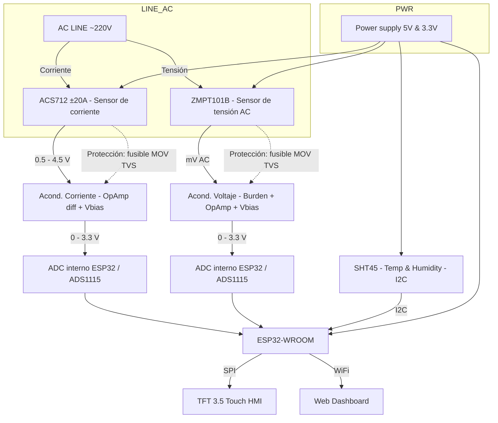
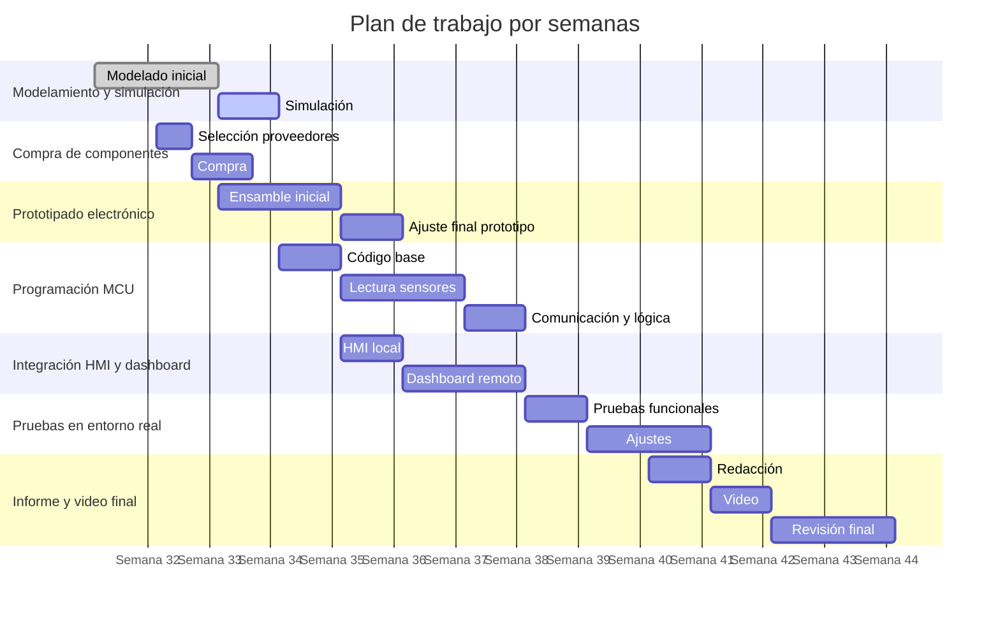

---
### Juan Diego Lemus Rey — RRY 0000243911 — [juanlere@unisabana.edu.co](mailto:juanlere@unisabana.edu.co)
### **Profesor:** Dr. Andry Contreras — Instrumentación ENF
---

## Índice

1. Resumen
2. Objetivos
3. Descripción del sistema
4. Sensores

   - ACS712-20A (corriente)
   - ZMPT101B (tensión AC)
   - SHT45 (temperatura y humedad)

5. BOM preliminar
6. Diseño electrónico

   - ACS712 → ADC + 3.3V→ ESP32
   - ZMPT101B → ADC + 3.3V→ ESP32
   - SHT45 → I²C + 3.3V→ ESP32

7. Plan de trabajo (Gantt)
8. Análisis de riesgos y mitigaciones

---

## 1. Resumen

El proyecto **AGRAR SMART GREENHOUSE** propone una estación de monitoreo y análisis de consumo energético (tensión y corriente de actuador) y condiciones ambientales (temperatura y humedad) en un invernadero rural. Este procesos ya está siendo aplicado por la empresa Agrar Ingeniería SAS de Zipaquirá mediante un control PID e instrumentos de la compañía FullGauge de Brasil. Para el Avance 1 se entregan el modelamiento, selección de sensores, diseños electrónicos preliminares, BOM, cálculos de acondicionamiento y la planificación.
Sensores seleccionados:
**ACS712-20A** (corriente AC), **ZMPT101B** (tensión AC) y **SHT45** (temperatura y humedad).

---

## 2. Objetivos

**Objetivo general**  
Validar por modelamiento y simulación la viabilidad de una estación de adquisición que mida tensión (mains ~220 V variable), corriente (hasta ±20 A), y condiciones ambientales (T/H), y que entregue datos a un dashboard web y HMI TFT táctil; como prototipo para el desarrollo de un nuevo tipo de control más inteligente en la estación centralizada del control de invernaderos.

**Objetivos específicos**

1. Seleccionar, justificar y documentar sensores y electrónica de acondicionamiento.
2. Dimensionar y simular las etapas analógicas (acondicionamiento, filtrado) para compatibilizar con ESP32 (ADC 0–3.3 V).
3. Entregar informe técnico editable, Gantt y repositorio con estructura y archivos.

---

## 3. Descripción del sistema

---

## 4. Sensores seleccionados — descripción técnica completa y documentación oficial

### A. ACS712 (versión ±20 A)

**Resumen:** sensor de corriente Hall integrado (Allegro) para medida AC/DC. Salida analógica centrada en VCC/2; sensibilidad típica para versión 20A ≈ 100 mV/A; aislamiento galvánico entre conductor y electrónica. Datos oficiales y caracterización en la página/datasheet de Allegro. ([Allegro MicroSystems](https://www.allegromicro.com/-/media/files/datasheets/acs712-datasheet.ashx?utm_"[PDF] ACS712 - Allegro MicroSystems"))

#### **Clasificación**

- **Señal de salida:** Analógico
- **Energía:** Activo (requiere alimentación para funcionar)
- **Tipo de contacto:** No invasivo (aislamiento galvánico mediante efecto Hall)
- **Visualización:** Ciego (requiere sistema externo para mostrar datos)
- **Modo de operación:** Comparativo
- **Variable medida:** Corriente eléctrica AC/DC
- **Tecnología:** Efecto Hall

#### **Especificaciones:**

- Alimentación: 5.0 V típica.
- Sensitividad: típica 100 mV/A.
- Rango: ±20 A.
- Offset: Vout = Vcc/2
- Ancho de banda: hasta ~80 kHz
- Error típico de salida: ~1.5% TAE a 25 °C

**Limitaciones de uso en AGRAR SMART GREENHOUSE:**

- Limitación: alimentado típicamente a 5 V → salida puede llegar hasta ~4.5 V, **no compatible directamente** con ADC de ESP32 (máx 3.3 V) sin acondicionamiento o ADC externo tolerante a 5 V. Requiere estrategia de escalado/offset o usar un ADC externo diferencial.

---

### B. ZMPT101B

**Resumen funcional:** transformador de medida de precisión para tensión AC; salida en mV que se debe acondicionar para ser leída por un ADC. Proporciona aislamiento galvánico y linealidad dentro del rango nominal. Existen módulos comerciales que incluyen el ZMPT101B y circuito de acondicionamiento. ([EDN](https://www.edn.com/voltage-sensor/?utm "ZMPT101B AC Voltage Sensor Module Primer - EDN Network"))

#### **Clasificación:**

- **Señal de salida:** Analógico
- **Energía:** Pasivo (activo si tiene módulo amplificador)
- **Tipo de contacto:** No invasivo (mide por acoplamiento electromagnético, sin conexión eléctrica directa de alta tensión al ADC)
- **Visualización:** Ciego
- **Modo de operación:** Comparativo
- **Variable medida:** Tensión eléctrica AC
- **Tecnología:** Inductivo (transformador de medida)

#### **Especificaciones:**

- Tipo: transformador de medida (relación primaria/ secundaria diseñada para corrientes bajas, ejemplo 2 mA/2 mA).
- Rango típico de uso con módulos: permite medición de AC mains hasta ±250 V (depende del acondicionamiento del módulo).
- Precisión y linealidad: buena para medición de tensión si se respeta la corriente secundaria nominal y carga (burden resistor) correcta.

**Limitaciones de uso en AGRAR SMART GREENHOUSE:**

- Ventaja: aislamiento y robustez para redes rurales con picos.
- Limitación: salida muy pequeña → requiere amplificación y offset; además hay que proteger la línea primaria (fusible, varistor) y diseñar anti-aliasing para muestreo ADC.

---

### C. SHT45

**Resumen funcional:** sensor SMD digital de temperatura y humedad con calibración interna, alta precisión y muy bajo consumo. Comunicación I²C (dirección configurable), rango amplio y buena estabilidad. Ideal para monitoreo ambiental en invernaderos. ([Sensirion](https://sensirion.com/products/catalog/SHT45?utm "SHT45 - ±1.0% RH / ±0.1°C Digital humidity and temperature sensor"))

#### **Clasificación:**

- **Señal de salida:** Digital (I²C)
- **Energía:** Activo
- **Tipo de contacto:** Intrusivo (requiere exposición directa del sensor al aire del entorno)
- **Visualización:** Ciego
- **Modo de operación:** Comparativo
- **Variable medida:** Temperatura y Humedad relativa
- **Tecnología:** Capacitivo para humedad + termistor de silicio para temperatura

#### **Especificaciones:**

- Alimentación: 1.08 V — 3.6 V.
- Humedad: 0–100 % RH; precisión típica ±1.0 % RH (25–75 %).
- Temperatura: −40 °C – +125 °C; precisión típica ±0.1 °C (rango típico 0–75 °C).
- Interfaz: I²C, protocolos y comandos en el datasheet.

#### **Ventajas / limitaciones:**

- Ventajas: salida digital calibrada, no requiere ADC ni acondicionamiento analógico; robusto para registros.
- Limitación: exposición a suciedad/agua → se recomienda protección física (membrana) si el sensor queda expuesto. Sensirion ofrece versiones con filtro/membrana. ([Sensirion](https://sensirion.com/products/catalog/SHT45-AD1F?utm_"SHT45-AD1F - ±1.0% RH digital humidity sensor / filter membrane"))

### 4.6 Tabla de Clasificación

| Componente | Señal de salida | Energía | Tipo de contacto | Visualización | Modo de operación | Variable medida | Tecnología             |
| ---------- | --------------- | ------- | ---------------- | ------------- | ----------------- | --------------- | ---------------------- |
| ACS712-20A | Analógico       | Activo  | Intrusivo        | Ciego         | Comparativo       | Corriente AC/DC | Efecto Hall            |
| ZMPT101B   | Analógico       | Activo  | Intrusivo        | Ciego         | Comparativo       | Voltaje AC      | Inductivo              |
| SHT45      | Digital         | Activo  | No ivasivo       | Ciego         | Comparativo       | Temp. y Humedad | Capacitivo + Termistor |
|            |                 |         |                  |               |                   |                 |                        |

**Nota:** En el ZMPT101B, el transformador es pasivo, pero el módulo comercial incluye un amplificador operacional alimentado a 5 V.

---

## 5. Bill of Materials

|   # | Ítem                                                |                        Modelo | Cant. | Precio unitario (COP) |    Precio (COP) |
| --: | --------------------------------------------------- | ----------------------------: | ----: | --------------------: | --------------: |
|   1 | SoC                                                 |          ESP32-WROOM DevBoard |     1 |                35,000 |          35,000 |
|   2 | Sensor de Corriente                                 |            Módulo ACS712 ±20A |     1 |                15,000 |          15,000 |
|   3 | Sensor tensión                                      |               Módulo ZMPT101B |     1 |                12,000 |          12,000 |
|   4 | Sensor Humedad y Temperatura                        |         SHT45-AD1B + breakout |     1 |                23,000 |          23,000 |
|   5 | Display HMI                                         |            TFT Touch SPI 3.5" |     1 |               120,000 |         120,000 |
|   6 | Op-amp rail-to-rail, dual (para offset/ganancia)    |      MCP6002 / TLV2372 (dual) |     1 |                 8,000 |           8,000 |
|   7 | Divisor de referencia (para Vbias = Vcc/2)          |       Resistencias 10k/10k 1% |     2 |                   300 |             600 |
|   8 | Potenciómetros trimmer 10k (ajuste offset/ganancia) |                10k multi-turn |     2 |                 4,500 |           9,000 |
|   9 | Condensadores (filtros y decoupling) kit            |     0.1µF, 1µF, 10µF assorted |     1 |                 4,000 |           4,000 |
|  10 | Resistencias (1% kit)                               |            Pack assorted (1%) |     1 |                 1,200 |           1,200 |
|  11 | TVS / diodos de clamp para entradas analógicas      | SMBJ/ SMAJ (según aplicación) |     2 |                 2,500 |           5,000 |
|  12 | Varistor (MOV) 275VAC                               |                   MOV 275 VAC |     1 |                10,000 |          10,000 |
|  13 | Fusible 1A + porta-fusible                          |           Fusible 1A y holder |     1 |                 3,000 |           3,000 |
|  14 | Conectores/ bornes para línea (2/3 pins)            |         Bornes screw terminal |     3 |                 2,000 |           6,000 |
|  15 | PCB prototipo simple (1 capa / protoboard final)    |       Fabricación PCB (small) |     1 |                20,000 |          20,000 |
|  16 | Carcasa IP54 (pequeña)                              |            Caja plástica IP54 |     1 |                30,000 |          30,000 |
|  17 | Pull-ups I²C (4.7k)                                 |                4.7k 0805 pack |     2 |                   300 |             600 |
|  18 | Cables y terminales (pack)                          |       Cables 22 AWG, ferrules |     1 |                 8,000 |           8,000 |
|  19 | ADC diferencial 16-bit (mejora precisión)           |                 ADS1115 (I2C) |     1 |                35,000 |          35,000 |
|  20 | Cables                                              |                               |     x |                10,000 |          10,000 |
|     | **TOTAL**                                           |                               |       |                       | **355,400 COP** |

---

## 6. Diseño electrónico preliminar y etapa de acondicionamiento — cálculos esenciales

---

## 6. Diseño electrónico preliminar y etapa de acondicionamiento

---

### 6.1 ACS712 (±20 A) → ADC ESP32

- **Señal actual:** Salida analógica centrada en 2.5 V, variando aproximadamente entre 0.5 V y 4.5 V.
- **Salida requerida:** Señal ajustada al rango seguro de 0–3.3 V para el ADC del ESP32.
- **Herramienta de acondicionamiento:** Amplificador diferencial/sumador con referencia (Vbias) para escalar y desplazar la señal al rango deseado.

---

### 6.2 ZMPT101B (tensión AC) → ADC ESP32

- **Señal actual:** Señal alterna de bajo nivel (mV a pocos cientos de mV), centrada en 0 V o con pequeño offset.
- **Salida requerida:** Señal centrada en Vbias (≈1.6 V) y con amplitud ajustada para no superar 3.3 V, compatible con ADC del ESP32.
- **Herramienta de acondicionamiento:** Amplificador no inversor con desplazamiento de nivel (Vbias), opcionalmente precedido por resistencia de carga (burden resistor) si se usa el transformador sin módulo.

---

### 6.3 SHT45 (temperatura y humedad) → I²C ESP32

- **Señal actual:** Salida digital I²C.
- **Salida requerida:** Conexión directa a bus I²C del ESP32 (3.3 V), con resistencias pull-up adecuadas.
- **Herramienta de acondicionamiento:** No requiere acondicionamiento analógico; solo filtrado mecánico (membrana protectora) en entornos hostiles.

---

### 6.4 Flujo de señal hasta el MCU

- **ACS712** → Amplificador diferencial/sumador (ajuste de escala y offset) → ADC ESP32.
- **ZMPT101B** → Amplificador no inversor con Vbias (ajuste de escala y offset) → ADC ESP32.
- **SHT45** → Conexión I²C directa → ESP32.

---

### 6.5 Herramientas y topologías utilizadas

- **Amplificador diferencial/sumador:** Para ajustar amplitud y desplazar offset de señales con referencia distinta al ADC.
- **Amplificador no inversor con referencia:** Para escalar y centrar señales AC en un punto medio compatible con el ADC.
- **Pull-ups I²C:** Resistencias a 3.3 V para comunicaciones digitales.
- **Protección y filtrado:** RC pasabajo en salidas analógicas antes del ADC, diodos TVS y resistencias serie para protección contra picos.

---

## 7. Plan de trabajo — Diagrama de Gantt

---

## 8. Análisis de riesgos y mitigaciones

- **Ruido y deriva en ACS712** — _Mitigación:_ filtro analógico + calibración periódica, usar referencia estable y ADC externo si precisión crítica.
- **Sobretensiones en red rural** — _Mitigación:_ fusibles en primaria, varistor, protección por relé aislador.
- **Medida incorrecta por error de acondicionamiento** — _Mitigación:_ simular SPICE y validar con señal de referencia (calibrador).
- **Ambiente extremo (T/H)** — _Mitigación:_ proteger SHT45 con filtro/membrana; colocar sensor en recinto ventilado.
- **Compatibilidad de alimentación MCU/sensor (5 V vs 3.3 V)** — _Mitigación:_ uso de condicionadores o ADC externos y separación de dominios.

---

## 8. Simulación

Ver en Matlab []
